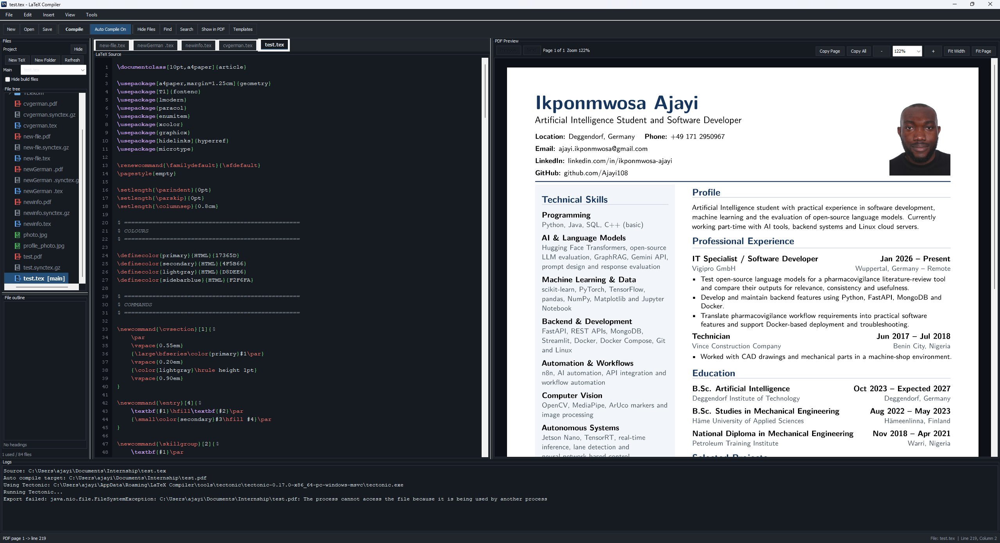

# LaTeX Compiler

A local desktop LaTeX editor and exporter for Windows first, with a path to macOS and Linux later.

The app is designed so end users install only the app. It can use bundled tools or prompt the user to download required tools into the app-managed data folder.

## Preview



## Current Features

- Create, open, edit, and save `.tex` files
- Start new documents from a richer LaTeX example with sections, math, tables, and charts
- Edit LaTeX with syntax colors and line numbers
- Insert, copy, and PDF-preview built-in templates for tables, graphs, equations, figures, and resume sections
- Save selected LaTeX as reusable custom templates stored in the app data folder
- Export to PDF with Tectonic
- Preview the compiled PDF inside the app
- Browse project files in a VS Code-style expandable tree
- Drag and drop files or folders in the tree to move them into different folders
- Keep the file panel scoped to the opened project folder, like a local workspace
- Navigate headings from a file outline below the project tree
- Create, rename, move, copy, and delete project files from the file panel
- Select a main `.tex` file for multi-file projects
- Find and replace source text with `Ctrl+F` and `Ctrl+H`
- Search across the opened project with `Ctrl+Shift+F`
- Click LaTeX log line references to jump back to the editor
- Jump from the current source line to the matching PDF page with `Ctrl+Shift+J`
- Show grouped compiler issues with error/warning colors, line jumps, hints, and source highlighting
- Auto-refresh the file panel when project files change outside the app
- Switch between system, light, and dark mode from the View menu
- Save crash logs locally and open a prefilled GitHub bug report from the Tools menu
- Show or hide export logs
- Export to Word `.docx` with Pandoc
- Shows export logs inside the app
- Prompts before downloading missing command-line tools
- Shows Java, Tectonic, Pandoc, project, output folder, and compile settings inside the app
- Opens generated exports with the system viewer

## Tool Strategy

The app resolves tools in this order:

1. Bundled tools under `tools/<platform>/`
2. App-managed tools under the user data directory
3. Developer tools already available on `PATH`

For Windows, the bundled layout is:

```text
tools/
  windows/
    tectonic.exe
    pandoc.exe
```

If a required tool is missing, the app can prompt to download the latest matching GitHub release asset into its own app data folder.

## Requirements for Developers

- JDK 21 or newer
- Gradle 8 or newer is optional
- WiX Toolset is needed only when creating a Windows `.exe` installer locally

End users do not need to install Java when the app is packaged with `jpackage`.

## Run Locally

```powershell
gradle run
```

If you do not have Gradle, run with:

```powershell
.\scripts\run-dev.ps1
```

If PowerShell blocks scripts, use:

```powershell
powershell -ExecutionPolicy Bypass -File .\scripts\run-dev.ps1
```

Or compile a jar with:

```powershell
.\scripts\build-jar.ps1
```

## Crash Logs and Bug Reports

Unexpected app crashes are written to the app data logs folder:

```text
%APPDATA%\LaTeX Compiler\logs\
```

Use `Tools > Report Bug...` to open a prefilled GitHub issue. The report includes basic app/system context, and you can choose whether to include the latest crash log because it may contain local file paths.

## Build

```powershell
gradle clean build
```

## Create a Windows Installer

Install JDK 21, close any running copy of LaTeX Compiler, then run:

```powershell
.\scripts\package-windows.ps1
```

The installer output is written to `installer/`.

By default the script creates a per-user installer to avoid requiring admin rights for normal installs. Use `-MachineInstall` if you intentionally want a machine-wide installer.

The packaging script stages every runtime jar in `build/jpackage-input` before calling `jpackage`. This keeps dependency jars such as PDFBox beside the app jar in the installed application.

Unsigned local installers may still be blocked or warned by Windows Smart App Control. That is expected for personal builds. A public release should eventually be code-signed to build Windows reputation and reduce those warnings.

## GitHub Releases

The workflow in `.github/workflows/release.yml` builds a Windows installer when you push a tag like:

```text
v0.1.0
```

The generated `.exe` installer is uploaded to the GitHub Release.

## Roadmap

- PowerPoint export for slide-friendly LaTeX documents
- Google Drive sync with user-approved OAuth
- macOS and Linux packaging
